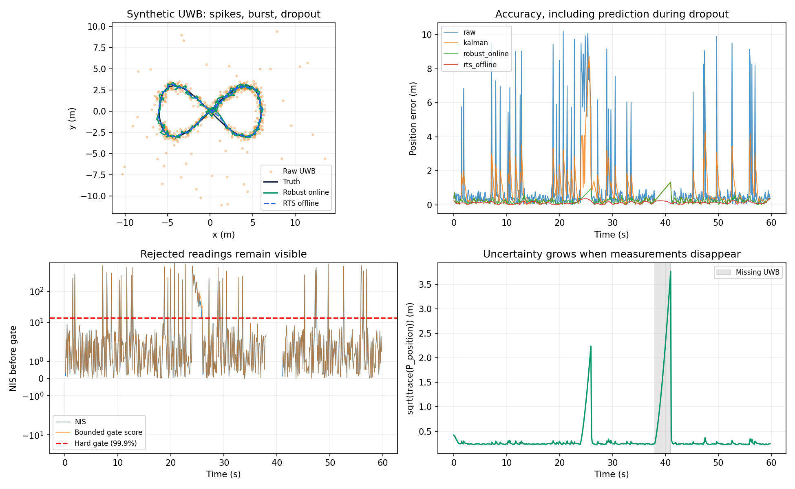

# Kalman Filter Pilot — hoàn thiện lab và lọc UWB 2D

Project gồm notebook Kalman/hợp nhất cảm biến đã có lời giải và bộ lọc UWB
chạy theo luồng hoặc từ CSV. Đầu vào UWB hiện là **tọa độ x/y (m), timestamp
lúc đo (s)**. Chưa có log UWB phần cứng trong repository; kết quả kèm theo là
mô phỏng, không phải độ chính xác cam kết cho thiết bị thật.

## Chạy ngay

```bash
python -m pip install -r requirements.txt
python -m uwb_filter reports/example_uwb.csv --output reports/example_filtered.csv --smooth
python -m unittest discover -s tests -v
```

Đổi `reports/example_uwb.csv` thành CSV của bạn với cột `timestamp,x,y` và
cột tùy chọn `sigma` (độ lệch chuẩn mỗi trục, m). `--sigma 0.3 --q 0.5` là
mặc định demo; cần hiệu chỉnh bằng log thiết bị. `--smooth` thêm kết quả
**offline có sử dụng dữ liệu tương lai**; cột x/y luôn là kết quả online.

## Cấu trúc

| Đường dẫn | Vai trò |
|---|---|
| [Lab/kalman_fusion_lab_STUDENT.ipynb](Lab/kalman_fusion_lab_STUDENT.ipynb) | Lab đã điền bài 5–8, chạy và lưu output; Phần 9 dùng STUDENT_ID 02939 |
| [uwb_filter/core.py](uwb_filter/core.py) | Kalman, gate, phục hồi, calibration, RTS |
| [uwb_filter/__main__.py](uwb_filter/__main__.py) | Đọc CSV, xuất kết quả và trạng thái từng mẫu |
| [scripts/benchmark_uwb.py](scripts/benchmark_uwb.py) | So sánh 5 phương pháp trên 6 kịch bản, 10 seed |
| [scripts/run_notebook.py](scripts/run_notebook.py) | Chạy toàn bộ cell, lưu số liệu và biểu đồ không cần Jupyter |
| [tests/test_uwb.py](tests/test_uwb.py) | Kiểm tra độ chính xác, nhân quả, outlier, mất mẫu, phục hồi, covariance |
| [docs/UWB_DESIGN.md](docs/UWB_DESIGN.md) | Giải thích cấu trúc, lý do chọn, hướng dẫn tinh chỉnh và giới hạn |
| [reports/RESULTS.md](reports/RESULTS.md) | Kết quả đo mô phỏng và cách tái lập |

## Vì sao chọn cấu trúc này?

Kalman vị trí–vận tốc giảm rung trong khi vẫn dự đoán chuyển động giữa các
mẫu. Gate và giảm trọng số ngăn điểm UWB bất thường kéo lệch quỹ đạo. Cơ chế
phục hồi kiểm tra cả chuỗi mẫu, covariance phản ánh thời gian mất tín hiệu.
RTS dùng cho xem lại log khi muốn tận dụng toàn bộ dữ liệu để làm mượt.

Xem [thiết kế chi tiết](docs/UWB_DESIGN.md) và [kết quả](reports/RESULTS.md).



## Notebook và tái lập

Python 3.9+, NumPy, SciPy, Matplotlib. Mở notebook bằng Jupyter/Colab nếu muốn
thao tác tương tác (`jupyter`, `ipywidgets` là tùy chọn), hoặc chạy:

```bash
MPLCONFIGDIR=/tmp/uwb-mpl python scripts/run_notebook.py
MPLCONFIGDIR=/tmp/uwb-mpl python scripts/benchmark_uwb.py
```

Notebook dùng `STUDENT_ID="02939"` theo mã số người dùng cung cấp.
Báo cáo cá nhân: [reports/LAB_02939.md](reports/LAB_02939.md).
Khi đổi ID, đọc lại NIS/residual và sửa chẩn đoán Phần 9. Các file chấm bài
của giảng viên được README cũ nhắc tới không có trong checkout này.
