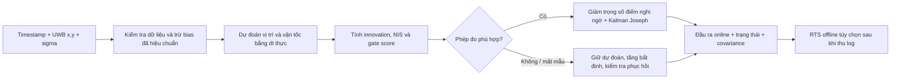

# Bộ lọc UWB: cấu trúc, lựa chọn và giới hạn

## 1. Đã đọc và hoàn thiện những gì?

Repository ban đầu có README và một notebook 119 cell. README còn nhắc tới
file giảng viên nhưng các file đó không có trong checkout. Notebook gồm:

- Phần 1–4: trung bình trượt, Gaussian, Kalman 1D, hiệu chỉnh bằng NIS.
- Phần 5–7: Kalman 2D, hợp nhất LiDAR/radar/camera, chặn outlier, timestamp.
- Phần 9: GPS + UWB mô phỏng theo ID, chẩn đoán bias/nhiễu/burst.
- Phần 8 và sau giờ: radar range-bearing EKF, cửa sổ hiệu chỉnh, mất tín hiệu.

Đã điền `make_F`, `make_H`, `KalmanFilter.predict/update`, `run_fusion`,
`gated_update`, `h_rb`, `H_rb`; cập nhật covariance dạng Joseph và dùng `solve`.
Notebook đã lưu output. Phần 9 dùng STUDENT_ID `02939`, chẩn đoán bằng số
quan sát, không bật `_reveal_truth`. Đổi ID cần chẩn đoán lại các nhãn.
Notebook giữ mô hình học tập độc lập để mở riêng trên Colab; bộ lọc UWB nằm
trong package riêng để chạy thật theo luồng, không phụ thuộc biến toàn cục của lab.

## 2. Phạm vi dữ liệu

Đầu vào là **tọa độ UWB 2D**, timestamp lúc đo tính bằng giây, vị trí bằng mét,
trong cùng hệ tọa độ. Một tracker dành cho một tag. Không trộn nhiều tag.
Đây chưa phải bộ giải khoảng cách từ các anchor, chưa có driver serial/MQTT.
Nếu thiết bị xuất range: cần tọa độ anchor, độ cao tag, hiệu chỉnh từng anchor
và hàm đo `h_i(x)=||position-anchor_i||`; khi đó dùng EKF range hoặc giải vị trí
có đánh trọng số trước khi đưa vào tracker. Không đưa range vào cột x/y.

CSV bắt buộc `timestamp,x,y`; tùy chọn `sigma` cho độ lệch chuẩn từng trục mỗi
mẫu. Dùng `nan,nan` khi mất fix. Timestamp phải tăng nghiêm ngặt; timestamp trùng
hoặc đảo thứ tự bị báo lỗi để tránh double-count và dt âm. Với dữ liệu nhiều
cảm biến cùng thời điểm, dùng vòng fusion của notebook. Sigma là **độ lệch
chuẩn**, R = sigma² I. API hiện chưa nhận covariance 2×2 tương quan/khác trục.

## 3. Luồng xử lý và lý do



**Trạng thái `[x,y,vx,vy]`.** UWB đo vị trí nhưng vận tốc giúp dự đoán giữa các
mẫu; nhờ vậy không cần cửa sổ trung bình dài gây trễ. Mô hình vận tốc không đổi
cục bộ có ít tham số, phù hợp khi chưa có IMU. Gia tốc được thừa nhận bằng Q;
không giả định vật luôn chuyển động thẳng mãi. Chưa dùng IMM/UKF vì phép đo
hiện tại tuyến tính và chưa có dữ liệu chứng minh sự phức tạp đó có ích.

**F, Q tính lại theo dt.** `x <- x + vx*dt`, `y <- y + vy*dt`.
Với mỗi trục, block Q = `q * [[dt³/3, dt²/2], [dt²/2, dt]]`, q có đơn vị
m²/s³. Đây là gia tốc nhiễu trắng liên tục; không dùng nhầm công thức dt⁴ của
mô hình gia tốc ngẫu nhiên giữ cố định từng bước. Khi thiếu mẫu, covariance tăng.

**R từ đo đạc.** Mặc định sigma=0.3 m/trục chỉ là giả định của demo mới (lab cũ
có UWB sigma=1 m). Cần đo lại cho thiết bị. Có thể đưa sigma theo từng fix nếu
chất lượng thiết bị đã được hiệu chuẩn; không coi RSSI là sigma nếu chưa xây
quan hệ bằng dữ liệu thực. Q mặc định 0.5 là điểm bắt đầu cho chuyển động demo,
không phải tham số tối ưu cho mọi thiết bị.

**Hai lớp kiểm tra outlier.** NIS = innovationᵀ S⁻¹ innovation, S = Pxy + R,
được lưu **trước khi quyết định nhận/bỏ**. Nếu P lớn do mất dữ liệu, gate dựa
hoàn toàn trên NIS sẽ mở rộng và có thể nuốt điểm nhảy lớn. Vì vậy dùng thêm
covariance dự đoán có eigenvalue giới hạn ở `max_gate_sigma²` (mặc định 1 m²)
để tính `gate_score`; P thật không bị cắt. Gate score vượt 13.816 thì bỏ mẫu.
13.816 là mốc chi-square 2D ở 99.9%, nhưng **gate_score đã giới hạn covariance
là heuristic**, không được diễn giải là đảm bảo chỉ bỏ 0.1% mẫu tốt.

Điểm được nhận nhưng NIS > 5.991 được tăng R theo NIS/5.991 để giảm tác động.
Không chạy median hay moving average trước Kalman: thao tác đó tạo tương quan
thời gian mà R độc lập sẽ không mô tả đúng, đồng thời thêm trễ.

**Phục hồi có điều kiện.** Khi mất cập nhật ít nhất 1 giây, xét 8 điểm bị từ
chối gần nhất. Fit một đường vị trí–thời gian có trọng số sigma. Chỉ bắt lại
khi residual chuẩn hóa RMS < 2, tốc độ <=15 m/s và khoảng cách giữa mẫu <=1 s.
Ghi `reinitialized` và tăng `segment`. Không reset chỉ vì đủ số lần từ chối.
Các ngưỡng là cấu hình theo ứng dụng, vẫn có thể nhận nhầm một cụm NLOS lệch
nhưng di chuyển nhất quán; một cảm biến không thể phân biệt chắc chắn trường
hợp đó với vật đã đổi vị trí. Cần nguồn tham chiếu để giải quyết.

**Số học ổn định.** `solve(S, ...)` thay vì nghịch đảo tường minh; Joseph:
`P=(I-KH)P(I-KH)^T+KRK^T`, rồi đối xứng hóa. Tránh covariance âm do sai số làm
tròn. Đầu ra luôn có covariance và tuổi lần nhận mẫu cuối; `stale=True` khi
quá 1 giây không có cập nhật được chấp nhận. Gọi `step(t,[nan,nan])` theo timer
nếu không có gói tin, để ứng dụng vẫn nhận dự đoán và cờ stale.

**RTS làm mượt offline.** Chạy ngược từ cuối log, dùng tương lai để sửa ước
lượng quá khứ. Không thể dùng các cột `offline_x/y` như kết quả online. RTS
không nối qua lần reinitialize; thiếu dữ liệu trước fix đầu tiên giữ NaN.
Do gate và R phụ thuộc dữ liệu, covariance sau lọc/smoothing là xấp xỉ có điều
kiện trên các quyết định đã chọn, không phải bảo đảm xác suất trong NLOS.

## 4. Dùng trên dữ liệu của bạn

```bash
python -m pip install -r requirements.txt
python -m uwb_filter reports/example_uwb.csv --output reports/example_filtered.csv --sigma 0.3 --q 0.5 --smooth
# Thay file đầu vào khi đã có log thật:
python -m uwb_filter du_lieu_uwb.csv --output ket_qua.csv --sigma 0.3 --q 0.5
```

API online:

```python
from uwb_filter import UWBTracker, Config
tracker = UWBTracker(Config(sigma=0.3, q=0.5))
result = tracker.step(0.0, [1.2, 2.4])
result = tracker.step(0.1, [1.3, 2.5])
print(result['x'][:2], result['status'], result['stale'])
```

Hiệu chuẩn ở vị trí đứng yên và LOS:

```python
from uwb_filter import calibrate_stationary
cal = calibrate_stationary(static_xy, reference=[known_x, known_y])
# cal['sigma'], cal['bias']; cần >=20 mẫu, nên thu nhiều vị trí và hướng tag.
```

MAD ước lượng nhiễu ít bị kéo bởi spike; nó không phải covariance tổng thể
khi đa số log là NLOS hoặc tag đang chuyển động. Không có reference thì chỉ
ước lượng sigma, không tự biết bias tuyệt đối. Trừ bias đã biết bằng `--bias bx by`.
Không học bias từ residual trung bình của chính UWB rồi tuyên bố hết lệch.

Đầu ra CSV chứa raw, online x/y/vx/vy, sigma_x/y, cov_xy, NIS trước gate,
gate_score, r_scale, accepted, status, age_s, stale, segment và offline x/y
nếu yêu cầu. Giữ toàn bộ mẫu bị bỏ trong log để chẩn đoán, không chỉ báo NIS
của những điểm tốt đã qua gate.

## 5. Chọn tham số theo mục tiêu

1. Thu riêng log LOS đứng yên để đo sigma, bias ở vị trí chuẩn. Không trộn
   log dùng đánh giá vào hiệu chỉnh. Kiểm tra timestamp và đơn vị trước tiên.
2. Trên log chuyển động hiệu chỉnh có reference, thử q = 0.05, 0.1, 0.3, 0.5,
   1, 2. Q nhỏ mượt hơn khi đứng yên nhưng bám cua/phanh chậm hơn. Q lớn bám
   nhanh nhưng rung hơn. Không tự ép đứng yên vì có thể xóa chuyển động chậm.
3. So sánh RMSE, P95 sai số, sai số ở cua/phanh, jitter khi đứng yên, tỷ lệ
   bỏ nhầm điểm, thời gian phục hồi; chọn trên mục tiêu thực tế. Đánh giá trễ
   từ reference được đồng bộ capture time, không chỉ nhìn đường vẽ. Benchmark
   hiện có sai số theo thời điểm, chưa ước lượng trễ phần cứng hay trễ pha riêng.
4. Điều chỉnh gate cap, tốc độ tối đa và phục hồi theo vùng hoạt động. Khi tốc
   độ lớn hoặc mất fix lâu, gate chặt có thể bỏ dữ liệu tốt; xem cờ recovery.
5. Kiểm tra trên các phiên thu khác ngày và các tuyến đường chưa dùng để chọn
   tham số. NIS khỏe mạnh kỳ vọng khoảng **2** cho xy; sau gate không còn đúng
   nguyên phân phối chi-square. NIS gần 2 không tự chứng minh vị trí chính xác.

## 6. Kiểm thử và kết quả

```bash
python -m unittest discover -s tests -v
MPLCONFIGDIR=/tmp/uwb-mpl python scripts/benchmark_uwb.py
MPLCONFIGDIR=/tmp/uwb-mpl python scripts/run_notebook.py
```

Benchmark so sánh raw, moving average 7 mẫu, Kalman thường, robust online,
RTS offline; 6 kịch bản × 10 seed. Có tần số không đều, đứng yên, đường cong,
cua vuông/dừng, spike/burst, dropout và bias kéo dài. Mỗi phương pháp được
chấm cùng timestamp sau 3 s khởi động; dropout được báo riêng vì raw không
có điểm để so sánh. Truth chỉ đi vào scoring, không vào bộ lọc. Tất cả tham
số demo giữ cố định; đây là kiểm thử tổng hợp, không phải chứng nhận trên
phần cứng. Các kịch bản này đã được dùng để phát hiện/sửa lỗi thiết kế;
unit test độ chính xác dùng thêm seed 101, 202, 303.

Số cụ thể: `reports/benchmark_summary.json`, từng seed: `reports/benchmark.csv`.
Biểu đồ: `reports/uwb_comparison.png`; báo cáo tóm tắt: `reports/RESULTS.md`.
11 unit test kiểm tra công thức, tính nhân quả, covariance, mất mẫu, phục hồi,
dữ liệu lỗi, bias hiệu chuẩn, làm mượt và độ chính xác trên seed riêng.

## 7. Những giới hạn cần hiểu đúng

- Bias NLOS kéo dài tạo đường **mượt nhưng sai**. Gate/smoothing không tự
  khôi phục vị trí đúng từ một UWB duy nhất; cần anchor diagnostics, IMU,
  odometry hoặc reference độc lập đã được đồng bộ và hiệu chuẩn.
- Fix đầu tiên được tin để khởi tạo. Nếu điểm đó lỗi, cần kiểm tra chất lượng
  ban đầu hoặc prior từ ngoài. Bộ lọc không có thông tin để biết ngay nó sai.
- Mất cả UWB lâu thì vị trí chỉ là ngoại suy; xem covariance, age và stale.
- Không hỗ trợ replay các gói đến muộn; phía ingest phải buffer theo capture
  time hoặc bổ sung cơ chế rewind/replay. Sắp xếp lại log offline không giải
  quyết độ trễ của hệ thống online.
- Trung bình trượt có thể tốt hơn cấu hình Kalman di động khi vật đứng yên.
  RTS có thể kém online ở một số lỗi do mô hình và lựa chọn gate. Không có
  một bộ tham số “đẹp nhất” cho mọi quỹ đạo, môi trường và độ trễ.
